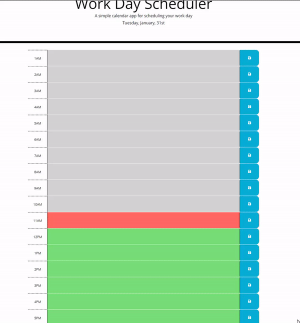

# schedule-planner

## Description

The goal of this project was to create a dynamic and responsive schedule planner. I used moment.js and jQuery to create this. From this project, I learned and reinforced previous knowledge on how to manipulate DOMs.

## Deployed Link Screenshot/Gif

## Installation

Use the deployed link

## Lisence

MIT Lisence

## Repo Link

https://github.com/YusufMbk/schedule-planner

## Deployed Link

https://yusufmbk.github.io/schedule-planner